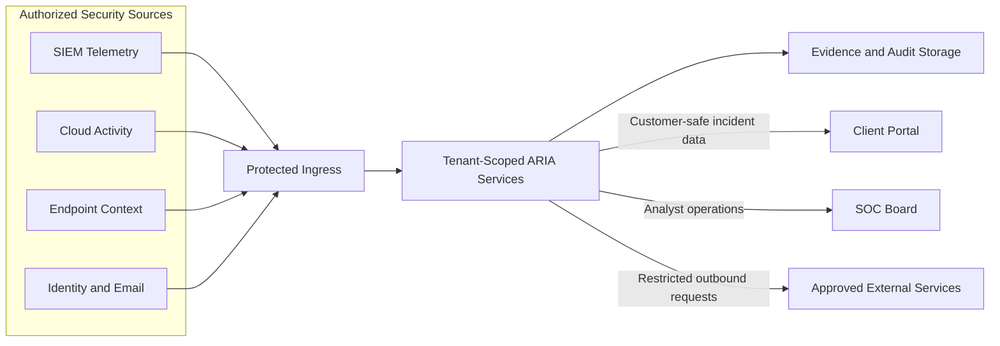

# Networking Overview

This document provides a sanitized view of ARIA network trust boundaries. Operational topology, host details, ports, service names, administrative commands, and recovery procedures stay in private runbooks.

## Public Architecture

## Trust Boundaries

### Source boundary

Only configured and authenticated sources submit telemetry. Source records enter tenant scope before investigation.

### Service boundary

ARIA services operate behind protected ingress. Internal services are not presented as public interfaces.

### Data boundary

Evidence, investigation state, audit records, and action receipts use tenant-scoped storage. Client-facing responses pass through authorization and secret-redaction controls.

### User boundary

The Client Portal and SOC Board remain separate:

- Client Portal access is limited to the authorized customer scope.
- SOC Board access is limited to authorized MSSP operations.
- Server-side authorization determines tenant scope.
- Request parameters do not grant cross-tenant access.

### Outbound boundary

External requests use approved connectors with restricted credentials, TLS verification, timeouts, redaction, and auditable results.

## Public Security Controls

- Tenant isolation
- Role-based authorization
- Protected ingress
- TLS for external communication
- Encrypted credential storage
- Secret redaction
- Scoped service access
- Evidence provenance
- Audit logging
- Policy-gated live actions

## Private Operations Material

The following information does not belong in this public repository:

- Infrastructure provider, region, and hardware
- Public IP addresses and internal hostnames
- Open ports and firewall rules
- Container, process, and network names
- Service paths and administrative commands
- Credentials, certificates, tokens, and environment files
- Retention schedules and resource limits
- Deployment, restart, recovery, and incident procedures
- Connector endpoints and authentication details

Private operational runbooks should live in an access-controlled repository with reviewed membership and audit logging.
