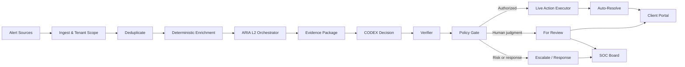
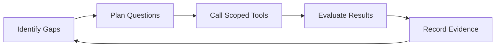

# ARIA SOC Pipeline

ARIA is the evidence-driven investigation and response pipeline behind SeenProtect.

This public repository documents the system architecture without exposing credentials, customer telemetry, production topology, private detection logic, or decision thresholds.

## Purpose

ARIA turns security detections into evidence-backed investigation outcomes.

The pipeline:

1. Ingests alerts from approved sources.
2. Applies tenant scope before investigation.
3. Removes duplicate source events.
4. Performs deterministic enrichment.
5. Collects available evidence and records missing artifacts.
6. Uses the ARIA L2 Orchestrator to investigate within a defined tool budget.
7. Builds an Evidence Package containing facts, contradictions, unknowns, and citations.
8. Uses CODEX to propose a verdict, confidence, and evidence-sufficiency state.
9. Verifies citations, evidence validity, and tenant scope.
10. Applies a deterministic Policy Gate.
11. Routes the case to a durable live action, analyst review, or escalation workflow.

## Current Architecture

Read the detailed [alert lifecycle](docs/architecture/alert-lifecycle.md).

## ARIA L2 Orchestrator

The L2 component operates as a controlled investigation loop:

The orchestrator uses scoped tools for SIEM search, endpoint context, identity activity, email telemetry, threat intelligence, and alert history. Missing data stays unknown. Missing data does not become benign evidence.

Read the detailed [L2 Orchestrator design](docs/architecture/l2-orchestrator.md).

## Evidence and CODEX

The Evidence Package separates:

- Facts
- Contradictions
- Unknowns
- Citations
- Collection status
- Evidence provenance
- Missing artifacts

CODEX proposes:

- Verdict
- Confidence
- Evidence sufficiency

CODEX does not authorize an action. Verification and policy authorization occur after the proposal.

## Verification and Policy

The Verifier checks citation validity, evidence validity, and tenant scope.

The Policy Gate applies deterministic authorization rules. Approved automatic outcomes create durable actions for the Live Action Executor. Cases without sufficient support move to analyst review or escalation.

## Supported Source Categories

- Wazuh security telemetry
- Microsoft 365 activity
- Google Workspace activity
- Endpoint context
- Identity activity
- Email telemetry
- Threat intelligence
- Historical alert context

Connector availability depends on tenant configuration and authorized credentials.

## Security Controls

- Tenant isolation
- Role-based access
- Encrypted credential storage
- Secret redaction
- Evidence provenance
- Evidence integrity metadata
- Audit logs
- Scoped tool access
- Tool budgets
- Deterministic verification
- Policy-gated automation
- Durable action receipts

See [security and publication boundaries](docs/architecture/security-boundaries.md).

## User Interfaces

ARIA exposes separate experiences:

- Client Portal: customer and authorized third-party visibility into incidents, evidence, status, and reports.
- SOC Board: internal MSSP analyst operations, review, escalation, response, and case management.

The Client Portal and SOC Board have separate authorization models and responsibilities.

## Documentation

- [Alert Lifecycle](docs/architecture/alert-lifecycle.md)
- [ARIA L2 Orchestrator](docs/architecture/l2-orchestrator.md)
- [Security and Publication Boundaries](docs/architecture/security-boundaries.md)
- [Networking Overview](NETWORKING.md)

## Project Status

Architecture documentation does not prove deployment.

Use these labels when describing a capability:

| Status | Meaning |
|---|---|
| Implemented | Code exists in the relevant source repository. |
| Partially implemented | Some components exist, but the full path is incomplete. |
| Planned | Design exists without a complete implementation. |
| Production verified | Release identity, runtime health, and expected behavior were verified after deployment. |

## Implementation Components

The operational implementation repositories remain private.

| Component | Responsibility | Visibility |
|---|---|---|
| ARIA Engine | Connectors, investigations, evidence, policy, and live actions | Private |
| Client Portal | Customer incident visibility and authorized workflows | Private |
| SOC Board | MSSP analyst review, escalation, and response | Private |

Public examples must use fictional tenants, mock telemetry, placeholder credentials, and no production decision logic.

## Author

Abdullaah Yaseen

SOC Analyst and Founder, SeenProtect

[seenprotect.com](https://seenprotect.com) · [LinkedIn](https://linkedin.com/in/abdullaahyaseen)
