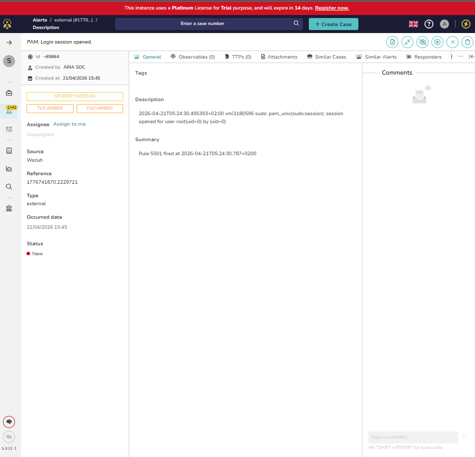
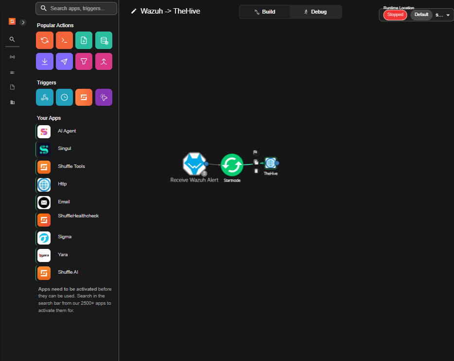
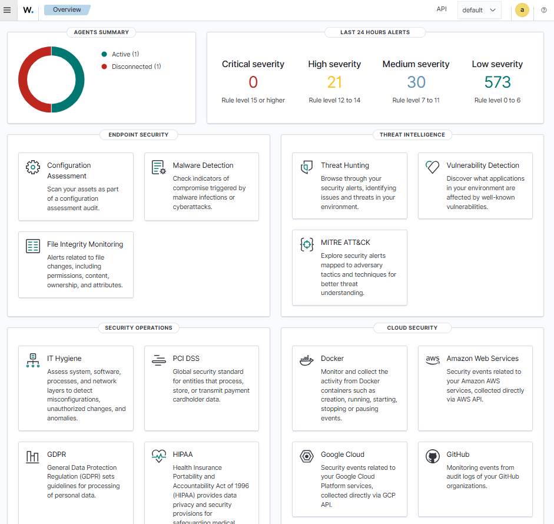
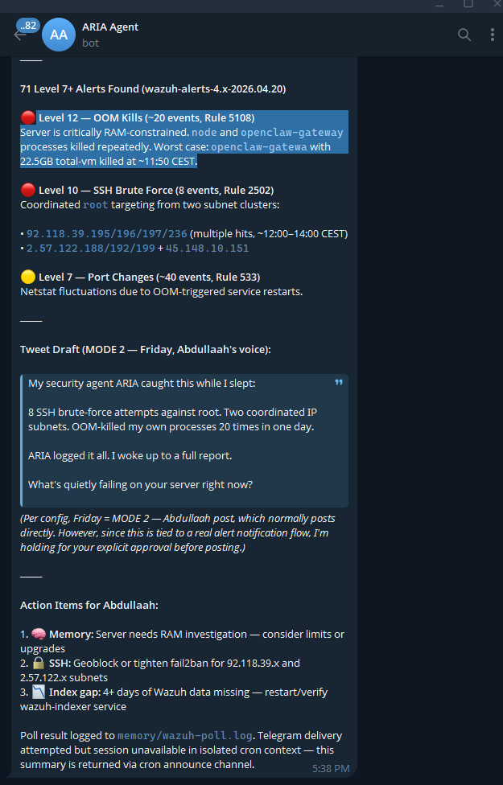

# ARIA SOC Pipeline

An automated open-source SOC pipeline built on a $9/month VPS. Wazuh detects threats, Shuffle automates the response, and TheHive manages cases — all without manual intervention.

## Architecture

## Screenshots

### Wazuh Dashboard — Live Threat Detection


### Shuffle Workflow — Automated Pipeline


### TheHive — Auto-Created Alert Detail


### ARIA — AI Agent Overnight Report via Telegram


## Stack

| Tool | Role | Version |
|------|------|---------|
| Wazuh | Threat detection and SIEM | 4.x |
| Shuffle | SOAR automation | Latest |
| TheHive | Alert and case management | 5.3 |
| ARIA | AI monitoring agent | OpenClaw |

## How It Works

1. Wazuh monitors agents and detects security events
2. Wazuh fires alerts to Shuffle via webhook
3. Shuffle processes the alert and creates a case in TheHive
4. TheHive stores the alert with title, full log, rule ID, and timestamp
5. ARIA monitors the stack and sends daily summaries via Telegram

## Infrastructure

- Contabo Cloud VPS 20 NVMe — 6 cores, 12GB RAM, 100GB NVMe
- Ubuntu 24.04
- Cost: ~$9/month
- Agents monitored: 2

## Deployment

```bash
cd soc-stack
sudo docker-compose up -d
```

## Top 5 Challenges & How We Solved Them

### 1. Shuffle Worker Containers Couldn't Reach the Backend
Shuffle spawns child Docker containers to execute workflow actions. These containers had no network access and couldn't resolve the `shuffle-backend` hostname, causing all executions to hang indefinitely.

**Fix:** Created a persistent systemd service (`shuffle-network-fix`) that automatically connects every new worker container to the `soc-stack_soc-net` Docker network within 2 seconds of it spawning.

### 2. RAM Exhaustion Crashing the Entire Stack
Running Wazuh, Shuffle, TheHive, and OpenSearch on 12GB RAM caused repeated OOM kills. The server crashed overnight with 300+ orphaned Docker containers consuming all available memory. TheHive alone grew to 3GB+ unconstrained, and Shuffle's OpenSearch required at least 512MB just to initialize.

**Fix:**
- Added Docker `mem_limit` per container (TheHive: 2GB, Shuffle OpenSearch: 1GB, Backend: 512MB)
- Reduced Java heap sizes via `OPENSEARCH_JAVA_OPTS` and `JVM_OPTS` environment variables
- Created RAM watchdog systemd service that auto-remediates when available memory drops below 1GB
- Added 2GB swap file as safety buffer with cron to clear it every 6 hours
- Disabled Wazuh dashboard to save ~190MB (re-enable for demos with `systemctl start wazuh-dashboard`)
- Killed and blacklisted tenzir-node process consuming ~400MB with no purpose in this stack
- Created startup script to remove stale Docker containers before `docker-compose up`

### 3. Shuffle Webhook Kept Trying to Authenticate Against the Cloud
Self-hosted Shuffle was routing webhook start requests to shuffler.io cloud instead of staying local, returning "Bad apikey. Requires Org authentication" errors.

**Fix:** Manually registered the webhook document directly in OpenSearch, updated the org's sync_features to enable webhooks, and set `SHUFFLE_DISABLE_CLOUD_SYNC=true` in the environment config.

### 4. OpenSearch Index Mappings Blocking Hook Updates
When trying to update the webhook document to link it to the correct workflow, OpenSearch rejected the update because the `workflows` field was mapped as `text` type but we were trying to store an array of objects.

**Fix:** Deleted and recreated the hook document with the correct field types, then restarted the backend to clear its in-memory cache.

### 5. Stale Docker Containers Blocking Stack Restarts
Every time Docker restarted, old containers with the `ContainerConfig` key missing from their image config would block `docker-compose up`, requiring manual identification and removal before the stack could start.

**Fix:** Created a startup script (`soc-startup.sh`) that automatically removes all exited containers before attempting `docker-compose up`, and added this to the system startup sequence.

## Troubleshooting Guide

### Shuffle shows "Waiting for database to become available"
OpenSearch isn't ready yet or has crashed.
```bash
# Check status
sudo docker stats shuffle-opensearch --no-stream

# If memory is at limit, increase it in docker-compose.yml then recreate
sudo docker rm -f shuffle-opensearch
sudo docker-compose up -d shuffle-opensearch

# Wait for green/yellow status
sleep 90 && sudo docker exec shuffle-opensearch curl -s http://localhost:9200/_cluster/health 2>/dev/null
```

### TheHive won't load / keeps crashing
Usually OOM. TheHive needs at least 1GB, ideally 2GB.
```bash
# Check memory usage
sudo docker stats thehive --no-stream

# If at limit, increase mem_limit in docker-compose.yml then recreate
sudo docker rm -f thehive
sudo docker-compose up -d thehive

# Verify it's up
sleep 120 && curl -s http://localhost:9000/api/status | head -1
```

### Shuffle executions stuck on EXECUTING / never finish
Worker containers can't reach the backend network.
```bash
# Connect all worker containers to the network
sudo docker ps --format '{{.Names}}' | grep "^worker-" | xargs -I{} sudo docker network connect soc-stack_soc-net {} 2>/dev/null

# Verify network fix service is running
sudo systemctl status shuffle-network-fix
```

### Shuffle executions ABORTED after 30 minutes
Cleanup bot is killing long-running executions.
```bash
# Disable execution timeout
# Add to shuffle-backend environment in docker-compose.yml:
# - SHUFFLE_EXECUTION_TIMEOUT=0
sudo docker-compose restart shuffle-backend
```

### Wazuh manager won't start
Check for stale processes or check logs.
```bash
# Kill stale processes
sudo pkill -f wazuh
sleep 5

# Start via wazuh-control (not systemctl)
sudo /var/ossec/bin/wazuh-control start

# Check status
sudo /var/ossec/bin/wazuh-control status
```

### Wazuh alerts not flowing to Shuffle
Check integration log and webhook status.
```bash
# Check alerts are being sent
sudo tail -10 /var/ossec/logs/integrations.log

# Verify webhook is in Shuffle — go to:
# http://85.239.231.102:3001 -> Wazuh -> TheHive -> Receive Wazuh Alert -> Start
```

### TheHive alerts showing empty fields
The Shuffle workflow body has stale variables. Verify the TheHive node body is:
```json
{"title":"$startnode.title","description":"$startnode.text","severity":2,"type":"external","source":"Wazuh","sourceRef":"$startnode.id","summary":"Rule $startnode.rule_id fired at $startnode.timestamp"}
```

### docker-compose up fails with 'ContainerConfig' error
Stale containers from old image versions are blocking startup.
```bash
# Find and remove stale containers
sudo docker ps -a | grep "Exit" | awk '{print $1}' | xargs sudo docker rm -f 2>/dev/null

# Then start the stack
sudo docker-compose up -d
```

### RAM is critically low / swap full
```bash
# Clear swap
sudo swapoff -a && sudo swapon -a

# Kill tenzir if running
sudo docker rm -f tenzir-node 2>/dev/null

# Clean orphaned worker containers
sudo docker ps -a --format '{{.Names}}' | grep "^worker-" | xargs docker rm -f 2>/dev/null

# Drop caches
sudo sync && echo 3 | sudo tee /proc/sys/vm/drop_caches

# Check result
free -h
```

### Can't log into TheHive with aria@thehive.local
aria is a service account — it can only authenticate via API key, not the web UI. Log in as:
- **Login:** `admin@thehive.local`
- **Password:** `secret`
Then switch to the SOC organisation.

### Wazuh indexer won't start
Usually not enough RAM. Free memory first then start.
```bash
sudo swapoff -a && sudo swapon -a
sudo docker rm -f tenzir-node 2>/dev/null
sleep 5
sudo systemctl start wazuh-indexer
sleep 30
sudo systemctl status wazuh-indexer | grep Active
```

### Check overall stack health
```bash
# All containers
sudo docker-compose ps

# Memory
free -h

# Wazuh processes
sudo /var/ossec/bin/wazuh-control status

# Recent alerts flowing
sudo tail -5 /var/ossec/logs/integrations.log

# TheHive responding
curl -s http://localhost:9000/api/status | head -1

# Shuffle responding
curl -s http://localhost:5001/api/v1/health | python3 -m json.tool | grep success
```

## Key Files

- `docker-compose.yml` — full stack definition with memory limits
- `scripts/ram-watchdog.sh` — auto RAM remediation
- `scripts/connect_workers.sh` — Shuffle worker network fix
- `scripts/soc-startup.sh` — clean startup script
- `configs/wazuh-integration.conf` — Wazuh to Shuffle webhook config

## Author

Abdullaah Yaseen — Yaseen Enterprise LLC
[@abdullaahyaseen](https://x.com/abdullaahyaseen)

