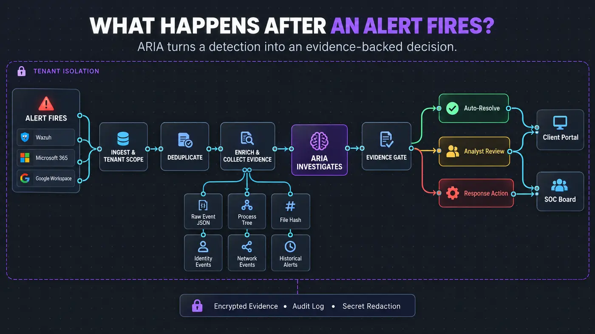
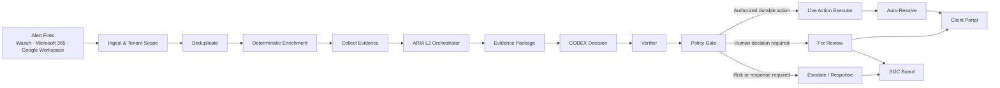

# Alert Lifecycle

This document shows the public, sanitized ARIA alert path. It excludes credentials, customer data, private detection logic, production topology, and decision thresholds.

## Stage responsibilities

| Stage | Responsibility |
|---|---|
| Ingest & Tenant Scope | Associates the alert with the correct tenant before investigation. |
| Deduplicate | Prevents repeated source events from creating duplicate investigations. |
| Deterministic Enrichment | Adds source metadata and non-AI intelligence before orchestration. |
| Collect Evidence | Retrieves available source artifacts and records missing artifacts explicitly. |
| L2 Orchestrator | Plans questions, calls scoped tools, evaluates results, records evidence, and repeats within budget. |
| Evidence Package | Separates facts, contradictions, unknowns, and citations. |
| CODEX Decision | Proposes a verdict, confidence, and evidence-sufficiency state. |
| Verifier | Checks citation validity, evidence validity, and tenant scope. |
| Policy Gate | Decides whether the verified proposal is authorized for automatic handling. |
| Live Action Executor | Claims and executes an approved durable action with an auditable result. |
| For Review | Routes cases requiring analyst judgment. |
| Escalate / Response | Routes higher-risk cases or response requirements to the SOC workflow. |

## Shared controls

The pipeline applies tenant isolation, evidence provenance, secret redaction, tool budgets, and audit tracing across every stage.

## Public documentation boundary

This diagram intentionally omits:

- Credentials and connector secrets
- Customer identifiers and telemetry
- Production network details
- Detection and suppression internals
- Auto-resolution thresholds
- Private prompts and policy rules
- Known vulnerabilities and active incident details
