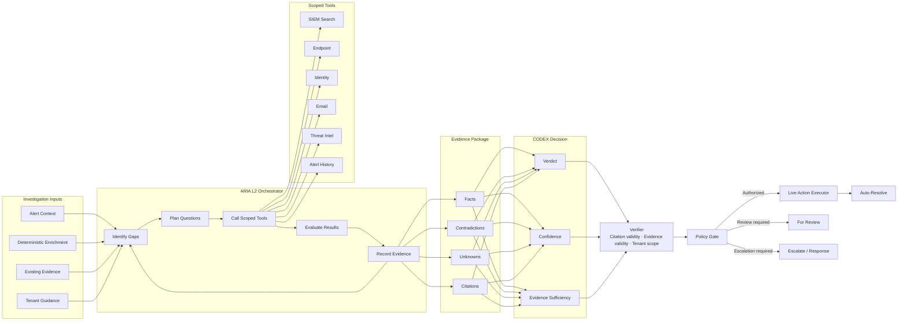

# ARIA L2 Orchestrator

The L2 component is an orchestrator. It does not bypass policy or execute unrestricted actions.

## Orchestration loop

1. Identify unanswered security questions and unavailable artifacts.
2. Plan the next evidence questions within the investigation budget.
3. Call only tenant-scoped, approved tools.
4. Evaluate returned records without treating missing data as benign evidence.
5. Persist evidence, provenance, collection status, and integrity metadata.
6. Repeat until the investigation reaches a supported decision or the budget ends.

## Evidence Package

The Evidence Package contains four distinct classes:

- Facts supported by stored evidence
- Contradictions between sources or claims
- Unknowns and missing artifacts
- Citations linking claims to evidence records

## CODEX Decision

CODEX proposes:

- Verdict
- Confidence
- Evidence sufficiency

The proposal does not authorize an action.

## Verifier

The Verifier checks:

- Every citation resolves to stored evidence
- Evidence belongs to the correct tenant and investigation
- Evidence status supports the cited claim
- Required evidence has not failed or gone missing

## Policy Gate

The Policy Gate applies deterministic authorization rules after verification. It routes the case to one of three lifecycle paths:

- Approved durable live action
- Analyst review
- Escalation or response

## Live Action Executor

An approved automatic outcome creates a durable action. A worker claims the action, executes it, records the result, and exposes failures for retry or analyst handling.
